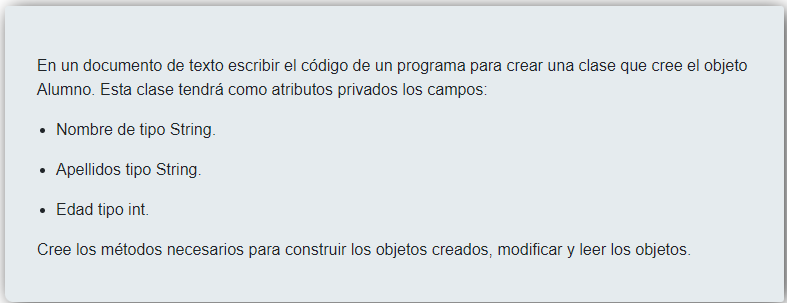
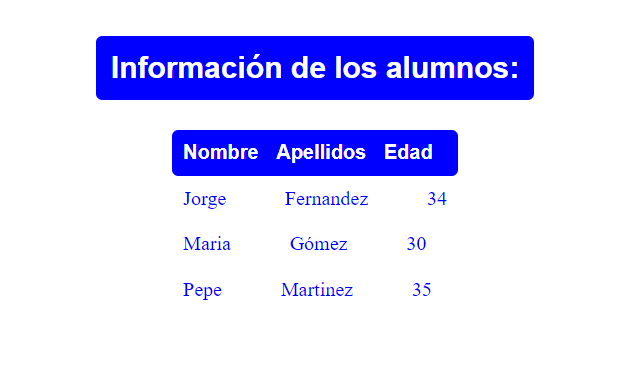

# EJERCÍCIO CLASES PHP CURSO DE PROGRAMACIÓN DE SOFTWARE LIBRE IECM

## Tecnologías
Php, apache, xamp, html, css

## Descripción

### Se ha creado una clase Alumnos en alumnos.php con los atributos: nombre tipado a string, apellidos tipado a string y edad tipado a int; constructor, y getter y setters; ya que las variables son protected. En data.php se crean tres objetos con datos, se modifican los datos del alumno 1 y se introducen los datos en un array asociativo que se va a leer en una tabla en el html.

